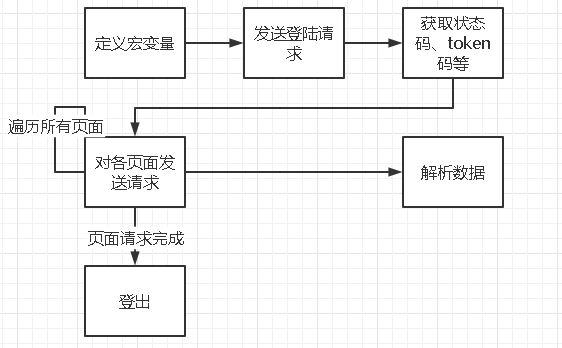

# Spider-Flow 开发流程
## 搭建 mock 服务器  
### 获取har包
详见《CMMP基于HAR包&APIFOX接口模 拟技术的服务器Web爬虫监控的开发概要设计》
::: warning
har包格式务必为 一个页面附带一个截图以及har包说明，以便后续的har包数据清洗。
:::
### 数据清洗
::: tip
建议使用浏览器自带的`F12开发者工具`， 将`har包`导入，可以更直观的看到`response`
:::
通过查找路由对应的response，与截图内的数据一一对应，则这就是所需的路由数据，将该条路由导入到`ApiFox`或者用文档记录。

### 搭建服务器
::: tip
由于`ApiFox`不支持返回text数据，则使用auto_router.py程序，将`har包`格式转为`json`，在程序内部进行添加文件，并输入域名，即可自动生成mock服务器.
:::
将路由按照《CMMP基于HAR包&APIFOX接口模 拟技术的服务器Web爬虫监控的开发概要设计》文档内的格式导入即可搭建成一个mock服务器。
```python
import json
import uuid
from types import FunctionType, CodeType

from flask import Flask

app = Flask(__name__)

code_1 = """
def %s()->str:
    return r'''%s'''
"""

index_url = "http://1.1.8.139"
path = ["3.json", "5.json"]

if __name__ == '__main__':
    router_list = []
    for each_path in path:
        with open(each_path, 'r') as fp:
            get_data = json.load(fp)
            router_list_1 = [
                {'url': i['request']['url'].split(index_url)[1], 'response': i['response']['content']['text']} for i
                in get_data['log']['entries']]  # 构建路由表
            router_list.extend(list(router_list_1))
    for i in router_list:
        foo_compile = compile(code_1 % ('a' + str(uuid.uuid1()).replace('-', ''), i['response']), "", "exec")  # 字符串转代码
        foo_code = [i for i in foo_compile.co_consts if isinstance(i, CodeType)][0]  # 只获取代码行
        func = FunctionType(foo_code, globals())  # 将代码变为函数
        app.add_url_rule('%s' % i['url'].split('?')[0], view_func=func)  # 注册flask路由

    app.run()

```
## spider-flow 模板
### spider-flow命名规范
详情请查看[《Spider-flow命名规范》](/naming-help/)

### 爬虫模板
总体流程如下图所示 \


## zabbix 监控模板
详情请查看[《Spider-flow命名规范》](/naming-help#zabbix监控项键值/)
