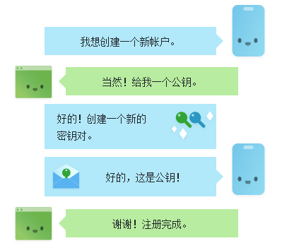
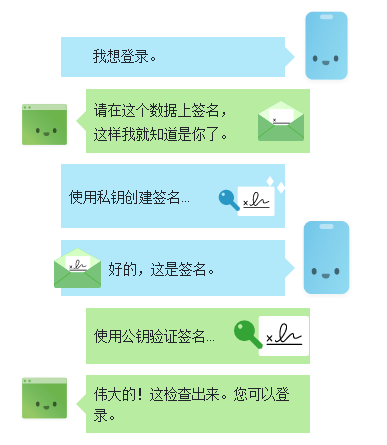

## 串口通信 （光学指纹识别）
通过购买指纹识别模块与主机进行串口连接并处理指纹注册、指纹识别请求
### 简要工作流程
#### 串口连接
* 通过 **USB/UART** 与主机链接
* 利用 **JS(serialport.js) / Python(pyserial) / 其他语言** 的串口通信库 与设备建立连接
#### 注册指纹
::: warning
指纹存储在模块内 需要在每个模块内都注册一遍指纹
:::
* 上位机（主机）向模块发送 **注册指纹** 指令包
* 模块接收到 **指令包** ，模块开始录取指纹，并将指纹存储在模块内，将结果以 **应答包** 的形式发送回上位机
* 上位机接收到 **应答包**，并读取 **确认码**  显示 **注册成功** \ **应答包错误** \ **无手指** \ **录入不成功** 

#### 指纹识别
基本与注册指纹流程一致
* 发送 **指令包**
* 接受 **指令包** 并处理指令，返回 **应答包**
* 处理 **应答包**
### 型号
::: tip
以下硬件设备包含 **指纹录入、图像处理、指纹比对、搜索和模板储存** 功能
:::
* [R307光学指纹模块](https://b2b.baidu.com/land?url=https%3A%2F%2Fwww.china.cn%2Fzhiwenshibieyi%2F4762168842.html&query=%E6%8C%87%E7%BA%B9%E8%AF%86%E5%88%AB%E6%A8%A1%E5%9D%97&lattr=&xzhid=31393402&from=b2b_straight&pi=baidu.b2b_straight.prod.7&category=%E5%AE%89%E5%85%A8%E9%98%B2%E6%8A%A4%3B%E6%A5%BC%E5%AE%87%E5%AE%89%E5%85%A8%3B%E6%8C%87%E7%BA%B9%E8%AF%86%E5%88%AB%E4%BB%AA&iid=fae9c4062a7d4c2e0f3227d6424be4cd&miniId=8469&jid=550545215&prod_type=0)  **￥ 59**
* [AS608 / FM-40 / FM-70](https://detail.tmall.com/item.htm?id=598280627281&ali_refid=a3_430673_1006:1235000100:N:ThHgLOSj5YLjWoNhM2F+STVt9Q0NFo+R:ae298bc5c71974ee3ef97a95d1e983ec&ali_trackid=1_ae298bc5c71974ee3ef97a95d1e983ec&spm=a2e0b.20350158.31919782.28&skuId=4200052117500) **￥ 41.5 / 58.7 / 80.6** 

## WebAuthn
[WebAuthn官方指导文档](https://webauthn.guide/#registration)
### 简要工作流程
[测试网站](https://try-webauthn.appspot.com/)
#### 后端
提供指纹注册、指纹识别的接口，并且需要将指纹的特征数据保存在数据库内
#### 注册流程
* 向后台发送注册请求，使用webauthn规范的格式携带 **用户信息**。
* 后台接收到注册请求，并生成随机 **挑战码**， 返回生成的 **挑战码** **用户信息** **服务器信息**
* 接收到数据后调用 **指纹识别API** 生成 **公钥** **凭证ID** ，将这些数据与**挑战码**发送回后端
* 后端接收到请求并验证 **挑战码** 将 **公钥** 存储到数据库中
 

#### 登陆流程
* 前台携带用户信息向后台发送登陆请求
* 后台接收到信息，生成 **挑战码** ，返回给前台
* 前台接收到 **挑战码** 调用 **指纹识别API** 利用 **私钥** 生成 **签名**，返回给后台
* 后台利用 **公钥** 验证 **签名**，返回验证结果。
 

### 支持的硬件
* [指纹识别器](https://detail.tmall.com/item.htm?spm=a230r.1.14.22.356b72deemZbvC&id=671640620193&ns=1&abbucket=1) **￥ 103 / 118**

## Windows Hello
暂未找到命令行级别的调用指令