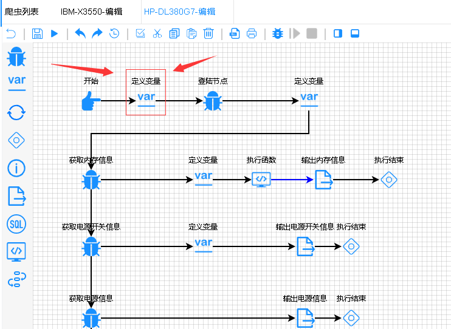
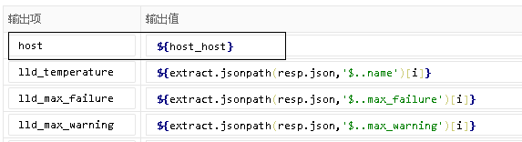
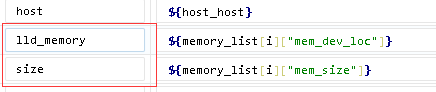
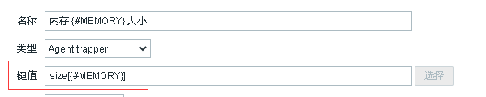
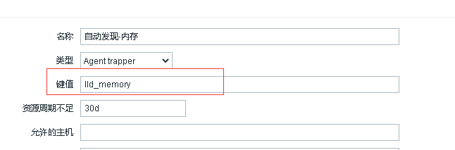
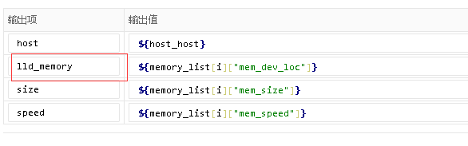
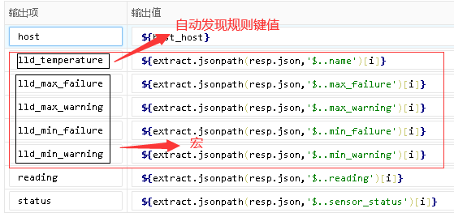
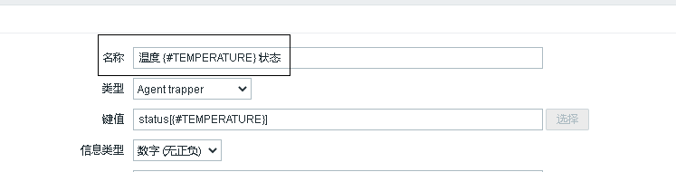

# Spider-flow命名规范
规范命名保证与Zabbix的互通
## 变量命名节点介绍
在定制爬虫模板的过程中，我们需要给模板设置变量，以下称该节点为 **变量节点**
::: warning
请注意，只能在第二个节点设置变量，该变量为全局变量
:::
### 变量节点

### host_host
该变量为主机名，一般不设置，如单独测试，将主机名复制过来即可。
### host_ip
该变量为主机ip，一般不设置，如单独测试，将ip复制过来即可。
## 输出文件
在测试阶段，可以不用输出到CSV文件，先跑通模板，再输出到文件
::: tip
文件全部输出到`/data/csv_file/`目录下，文件名要以模板名开头进行区分，命名如`/data/csv_file/HP-DL380G7-mem_info.csv`, 输出格式均选`UTF-8`，如下图所示.
:::
### host
输出文件首条字段一定是host，如图所示，该条字段为主机名，需在变量节点设置`host`变量。

### Zabbix监控项键值
一般取输出文件的字段拼接自动发现规则键值，例在spider-flow设置`size`字段，自动发现规则键值为`lld_memory`，那么在zabbix的监控项键值为`size[{#MEMORY}]`，如图所示
#### spider-flow

#### zabbix

### 自动发现
::: warning
请注意，自动发现规则键值在spider-flow中字段只能设置在第二个，并且zabbix类型为`Agent trapper`
:::
在自动发现当中，我们需要加入`lld_`前缀，如`lld_memory`，需与zabbix的自动发现一一对应，如下图所示
#### zabbix

#### spider-flow


### 宏
一条数据除自动发现规则键值外可设置多个宏，如风扇具有的最大警告阈值与最大故障阈值，设置多个`lld_`即可，顺序先后不定。
::: warning
需要注意的是，所有除自动发现规则键值外的宏均要设置在自动发现规则键值后的字段，如下图所示。
:::

#### 宏的使用
例在spider-flow中设置宏为`lld_max_failure`，一般在zabbix自动发现规则内的触发器使用，如`{#MAX_FAILURE}`即可使用该宏变量。

## 特殊字段
以下三个数据需要注意，因要与zabbix配合，状态字段的值有些特殊。
* 电源
* 温度
* 风扇

以上三个数据的状态字段，在spider-flow内，要与获取到状态正常的值映射进行对比，如正常那么要设置为`Normal`，如不正常则返回爬取的值，可利用三元操作符来实现该功能，代码如下
```js
${temps_list[i]["status"] == 'OP_STATUS_OK' ? 'Normal' :temps_list[i]["status"]}
```
在zabbix内,需要将以上三个特殊数据的名称进行固定，设置为 **电源/温度/风扇 {键值} 状态**，如图所示


## 登陆
在登录这里有一点特殊，有两个特有的监控项
* 错误码
* 错误信息

### 错误码
错误码即是登陆网页返回的状态码，如网站登陆请求失败（网站403,404等）则无请求码，如遇特殊的返回（密码错误），则返回`1001`,网站没有状态码返回`1002`

### 错误信息
一般为`密码错误`或`网站请求失败`

### 触发器
状态码为`1001` 触发器名称为`Server password error`， 状态码为`1002` 触发器名称为`Webserver error`， 则触发器触发后动作响应关闭爬虫模板

### 爬虫模板名称
调用爬虫模板接口名，一定为`模板数据采集` ！！！